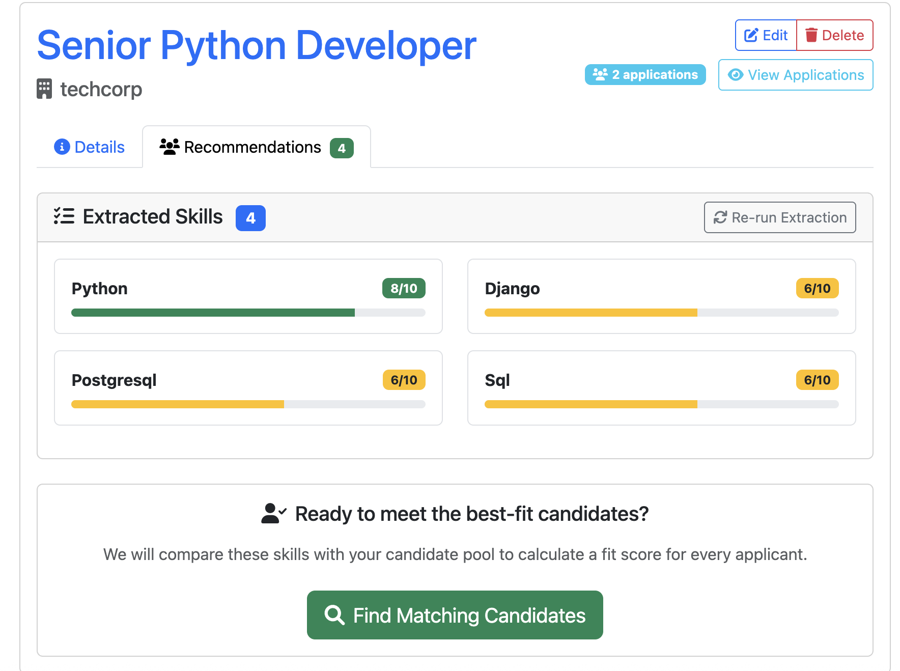
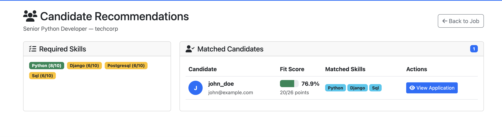

# Django Job Board

A comprehensive job board application built with Django that allows companies to post jobs and users to apply directly through the platform. Features include user role management, job posting, internal applications with resume uploads, and application status tracking.

## 🌐 Live Demo

**Live Application:** [https://vandana0402.pythonanywhere.com/](https://vandana0402.pythonanywhere.com/)

## 👥 Demo User Accounts

### **Admin User (Full Access)**
- **Username:** `admin`
- **Password:** `admin123`
- **Access:** Manage all users, jobs, and applications

### **Company Users (Post Jobs & Review Applications)**
- **Username:** `techcorp` | **Password:** `password123`
- **Username:** `innovate_inc` | **Password:** `password123`
- **Username:** `startup_xyz` | **Password:** `password123`
- **Access:** Post jobs, edit own postings, view applications, update application status

### **Regular Users (Browse & Apply for Jobs)**
- **Username:** `john_doe` | **Password:** `password123`
- **Username:** `jane_smith` | **Password:** `password123`
- **Access:** Browse jobs, submit applications with cover letter and resume

## ✨ Features

### 🔐 **User Authentication & Role Management**
- **Three User Roles:**
  - **Admin:** Full platform management via Django admin
  - **Company:** Post jobs, manage applications, update status
  - **User:** Browse jobs, submit applications
- Secure login/logout system
- Role-based access control throughout the application

### 💼 **Job Management**
- **For Companies:**
  - Post new job opportunities
  - Edit existing job postings
  - Delete job listings
  - View all applications for their jobs
  - **🤖 AI-Powered Candidate Recommendations (New Feature)**
    - Extract key skills from job descriptions using NLP-powered engine
    - System analyzes job description and identifies technical/soft skills with importance weights
    - Compare skills against candidate profiles to calculate fit scores
    - Instantly see which candidates are the best match for the position
    
    
    *Skills extracted from job description with importance weights (1-10 scale)*
    
    
    *Candidate recommendations ranked by fit score based on skill matching*

- **For Users:**
  - Browse all available jobs
  - Search jobs by title or location
  - View detailed job information

### 📝 **Application System**
- **Internal Application Process** (Similar to LinkedIn Easy Apply)
- Users can apply directly through the platform
- **Required Fields:**
  - Cover letter explaining interest and qualifications
  - Resume upload (PDF, DOC, DOCX format, max 5MB)
- **Application Status Tracking:**
  - Pending Review
  - Reviewed
  - Shortlisted
  - Rejected
  - Hired

### 🎯 **Application Management**
- **For Companies:**
  - View all applications for their job postings
  - Update application status with real-time notifications
  - Access applicant details, cover letters, and resumes
- **For Users:**
  - Track application status
  - View application history
  - Access submitted materials

### 🔍 **Search & Navigation**
- Search jobs by title or location
- Responsive Bootstrap 5 design
- Intuitive navigation based on user role
- Mobile-friendly interface

### 🛠️ **Admin Panel**
- Complete Django admin integration
- Manage users, profiles, jobs, and applications
- User role management
- Platform-wide oversight

## 🚀 **Technology Stack**

- **Backend:** Django 5.2.5
- **Database:** SQLite (development) / PostgreSQL (production ready)
- **Frontend:** Bootstrap 5, Font Awesome icons
- **File Handling:** Django FileField for resume uploads
- **Authentication:** Django's built-in User model with custom Profile extension
- **Deployment:** PythonAnywhere, Gunicorn, Whitenoise

## 📁 **Project Structure**

```
jobboard/
├── jobboard/          # Main project settings
├── jobs/              # Main application
│   ├── models.py      # User Profile, Job, Application models
│   ├── views.py       # All view functions
│   ├── forms.py       # Job and Application forms
│   ├── admin.py       # Django admin configuration
│   └── urls.py        # URL routing
├── templates/         # HTML templates
│   ├── base.html      # Base template with navigation
│   └── jobs/          # Job-specific templates
├── static/            # CSS, JavaScript, images
├── media/             # User-uploaded files (resumes)
└── manage.py          # Django management script
```

## 🛠️ **Installation & Setup**

### **Prerequisites**
- Python 3.11+
- pip
- virtual environment

### **Local Development Setup**

1. **Clone the repository**
   ```bash
   git clone <repository-url>
   cd jobboard
   ```

2. **Create virtual environment**
   ```bash
   python -m venv venv
   source venv/bin/activate  # On Windows: venv\Scripts\activate
   ```

3. **Install dependencies**
   ```bash
   pip install -r requirements.txt
   ```

4. **Run migrations**
   ```bash
   python manage.py migrate
   ```

5. **Create sample data**
   ```bash
   python manage.py create_sample_data
   ```

6. **Start development server**
   ```bash
   python manage.py runserver
   ```

7. **Access the application**
   - Main site: http://127.0.0.1:8000/
   - Admin panel: http://127.0.0.1:8000/admin/

## 🔒 **Security Features**

- CSRF protection on all forms
- File upload validation (size and type)
- Role-based access control
- Secure file handling for resumes
- Input sanitization and validation

## 🚀 **Deployment**

### **PythonAnywhere (Current)**
- Free tier hosting
- SQLite database
- Static file serving with Whitenoise
- Custom domain support

### **Production Ready**
- PostgreSQL database support
- Environment variable configuration
- Static file optimization
- Security headers and HTTPS
